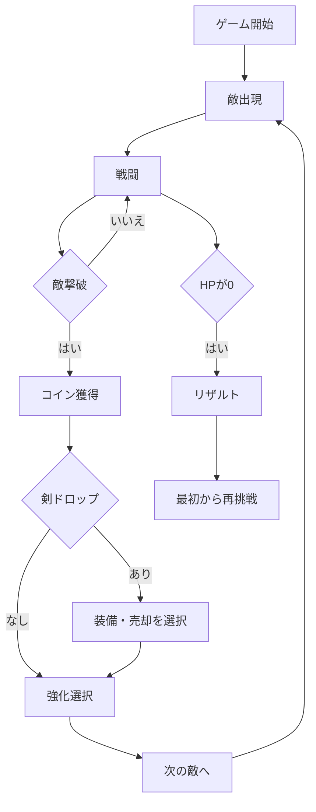
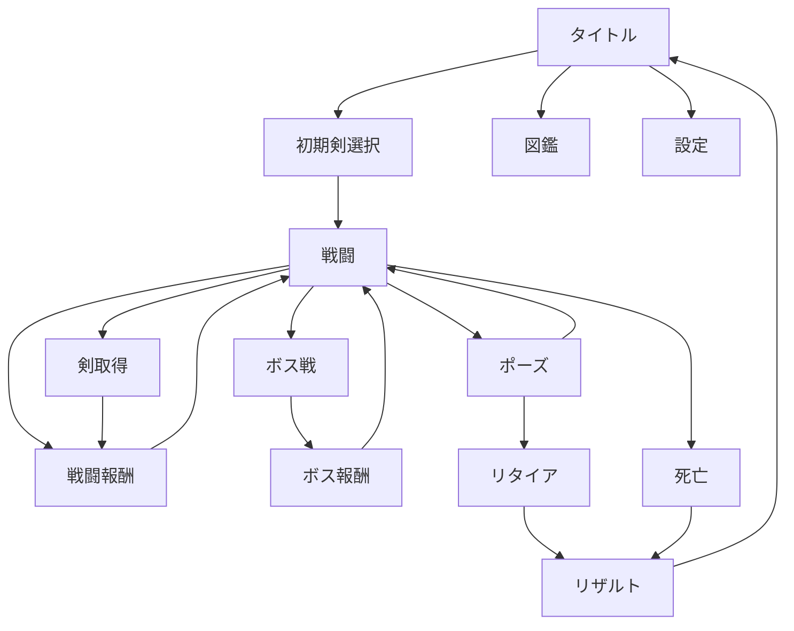

# スマートフォン向け剣育成ローグライトゲーム 設計書

## 1. 文書情報

| 項目 | 内容 |
|---|---|
| 文書名 | スマートフォン向け剣育成ローグライトゲーム 設計書 |
| 対象 | iOS / Android スマートフォン |
| 実行環境 | モバイルブラウザ |
| ゲームジャンル | 2Dアクション / ローグライト / ハクスラ |
| 想定プレイ時間 | 1プレイ 5〜15分 |
| 想定画面方向 | 縦画面 |
| 対象ユーザー | 短時間で遊べるアクションゲームを好むユーザー |
| 開発フェーズ | MVP設計 |

---

## 2. ゲーム概要

プレイヤーは剣を使って次々に出現する敵を倒し、より高い階層を目指す。

敵を倒すとコインを獲得でき、コインを使用して現在装備している剣を強化できる。

敵を倒した際、低確率で現在の剣より強力な剣がドロップする。

プレイヤーのHPが0になると、そのプレイで獲得した剣、コイン、強化状態を失い、最初の階層から再挑戦する。

---

## 3. コンセプト

### 3.1 コア体験

- 敵を倒す爽快感
- 剣の数値が成長する楽しさ
- 強い剣を拾った瞬間の興奮
- 強化した剣を持ったまま、どこまで進めるかという緊張感
- 死亡によってすべてを失うリスク
- 前回より深い階層へ到達する達成感

### 3.2 ゲームの特徴

本作の中心は、プレイヤー自身ではなく「剣の成長」とする。

プレイヤーは剣を拾い、コインを使って育成しながら敵を倒す。

強化済みの剣を使い続けるか、将来性のある新しい剣へ持ち替えるかという判断を繰り返す。

---

## 4. 対応環境

### 4.1 対象端末

- iPhone
- Androidスマートフォン
- タブレットは動作対象とするが、UI最適化はMVP後とする

### 4.2 対応ブラウザ

- iOS Safari
- Android Chrome

### 4.3 画面仕様

| 項目 | 仕様 |
|---|---|
| 画面方向 | 縦固定 |
| 基準解像度 | 390 × 844 px |
| 最小対応幅 | 360 px |
| 最大対応幅 | 480 px |
| 操作 | タップ、長押し、スワイプ |
| 片手操作 | 対応 |
| 横画面 | 非対応 |

---

## 5. 基本ゲームループ



---

## 6. プレイ進行

### 6.1 階層構成

- 1階層につき敵1体または敵1グループが出現する
- 5階層ごとにエリート敵が出現する
- 10階層ごとにボスが出現する
- ボス撃破後はHPを一定量回復する
- 階層に上限は設けず、無限に進行可能とする

### 6.2 1階層の流れ

1. 敵が出現する
2. プレイヤーが敵を攻撃する
3. 敵を倒す
4. コインを獲得する
5. 剣のドロップ判定を行う
6. 強化、回復、または次へ進む
7. 次の敵が出現する

---

## 7. 操作仕様

### 7.1 操作方針

スマートフォンでの片手操作を前提とし、画面下部に操作領域を集約する。

複雑な仮想スティックは採用しない。

### 7.2 基本操作

| 操作 | アクション |
|---|---|
| 画面タップ | 通常攻撃 |
| 画面長押し | 溜め攻撃 |
| 左スワイプ | 左回避 |
| 右スワイプ | 右回避 |
| ガードボタン長押し | ガード |
| 一時停止ボタン | ポーズ画面を開く |

### 7.3 MVP時の操作

MVPでは操作を以下に限定する。

| 操作 | アクション |
|---|---|
| タップ | 通常攻撃 |
| 長押し | 溜め攻撃 |
| 左右スワイプ | 回避 |

ガードはMVP後に追加する。

### 7.4 誤操作対策

- スワイプ判定中は攻撃を発動しない
- 長押し判定は300ms以上とする
- UIボタン上のタップは攻撃判定から除外する
- 画面端のブラウザ操作と競合しないよう、ゲーム領域の左右に余白を設ける
- iOS Safariのスクロール、拡大、長押しメニューを抑止する

---

## 8. 戦闘システム

### 8.1 戦闘形式

- 2Dリアルタイム戦闘
- 縦画面
- プレイヤーは画面下部
- 敵は画面上部
- 移動は回避時のみ行う
- 通常時はプレイヤーと敵の距離を一定に保つ

### 8.2 プレイヤーステータス

| ステータス | 内容 |
|---|---|
| HP | 0になるとゲームオーバー |
| 最大HP | プレイヤーが保持できるHP上限 |
| 防御力 | 被ダメージ軽減 |
| 回避回数 | 連続回避可能数 |
| 回避回復時間 | 回避回数が回復するまでの時間 |

### 8.3 剣ステータス

| ステータス | 内容 |
|---|---|
| 攻撃力 | 通常攻撃の基本ダメージ |
| 攻撃速度 | 次の攻撃までの待機時間 |
| 会心率 | クリティカル発生確率 |
| 会心倍率 | クリティカル時のダメージ倍率 |
| 溜め倍率 | 溜め攻撃時のダメージ倍率 |
| ノックバック | 敵をひるませる力 |
| 特殊効果 | 炎上、毒、吸血など |

### 8.4 ダメージ計算

```text
基本ダメージ = 剣攻撃力 × 攻撃倍率
```

```text
会心ダメージ = 基本ダメージ × 会心倍率
```

```text
最終被ダメージ = 敵攻撃力 × 100 ÷（100 + プレイヤー防御力）
```

### 8.5 通常攻撃

- タップで発動
- 攻撃速度に応じてクールタイムが発生
- 攻撃可能時のみ入力を受け付ける
- 命中時に小さなヒットストップを発生させる

### 8.6 溜め攻撃

- 300ms以上の長押しで溜め開始
- 最大1.5秒まで溜め可能
- 指を離した時点で発動
- 溜め時間に応じてダメージ倍率が上昇
- 溜め中は回避できない
- 敵の攻撃を受けると溜めが解除される

### 8.7 回避

- 左右スワイプで発動
- 回避中は短時間無敵
- 回避回数を1消費する
- 回避回数は時間経過で回復する

### 8.8 敵の攻撃予告

敵の攻撃前には必ず予備動作を表示する。

- 赤い発光
- 攻撃範囲表示
- 効果音
- 敵のモーション変化

スマートフォンでは画面が小さいため、攻撃予告は最低2種類の表現を組み合わせる。

---

## 9. 剣システム

### 9.1 剣の種類

#### ロングソード

- 標準的な性能
- 攻撃力、速度、会心率のバランスが良い

#### グレートソード

- 高攻撃力
- 攻撃速度が遅い
- 溜め攻撃が強い
- ノックバックが大きい

#### レイピア

- 攻撃速度が速い
- 会心率が高い
- 1撃の威力は低い

#### 魔剣

- 属性や状態異常を持つ
- 基礎性能は低め
- 特殊効果によって長期戦に強い

#### 呪剣

- 強力な性能とデメリットを持つ
- 高リスク、高リターン

### 9.2 レアリティ

| レアリティ | 表示 | 特徴 |
|---|---|---|
| Common | コモン | 特殊効果なし |
| Rare | レア | 特殊効果1個 |
| Epic | エピック | 特殊効果2個 |
| Legendary | レジェンダリー | 特殊効果3個 |
| Mythic | ミシック | 固有能力あり |

MVPでは以下の3段階のみ実装する。

- Common
- Rare
- Epic

### 9.3 剣ドロップ率

| 敵種 | ドロップ率 |
|---|---:|
| 通常敵 | 2% |
| 強敵 | 8% |
| エリート敵 | 20% |
| ボス | 100% |

### 9.4 剣生成

剣ドロップ時は以下の順序で生成する。

1. レアリティ抽選
2. 剣種抽選
3. 基礎ステータス決定
4. ランダム補正付与
5. 特殊効果抽選
6. 剣名生成

### 9.5 剣の比較

新しい剣を取得した場合、現在装備している剣と比較画面を表示する。

表示項目は以下とする。

- 攻撃力
- 攻撃速度
- 会心率
- 会心倍率
- 特殊効果
- 強化レベル
- 推定DPS

選択肢は以下とする。

- 装備する
- 売却する
- 現在の剣を維持する

---

## 10. コインシステム

### 10.1 獲得方法

- 敵撃破
- 剣売却
- エリート敵撃破
- ボス撃破
- 特殊条件達成

### 10.2 コインの保持

コインはプレイ中のみ有効とする。

死亡時にすべて消失する。

### 10.3 敵撃破時のコイン量

```text
獲得コイン = 基礎コイン × 階層補正 × 敵種補正
```

例：

```text
基礎コイン = 10
階層補正 = 1 + 階層 × 0.05
敵種補正 = 通常1.0 / 強敵1.5 / エリート3.0 / ボス10.0
```

---

## 11. 剣強化システム

### 11.1 強化タイミング

敵撃破後に強化画面を表示する。

プレイヤーは以下から1つ以上を選択できる。

- 攻撃力強化
- 攻撃速度強化
- 会心率強化
- 会心倍率強化
- 特殊効果強化
- HP回復
- 次へ進む

### 11.2 強化価格

```text
必要コイン = 基本価格 × 1.35 ^ 強化回数
```

小数点以下は切り上げる。

### 11.3 強化上限

| レアリティ | 最大強化レベル |
|---|---:|
| Common | 10 |
| Rare | 15 |
| Epic | 20 |
| Legendary | 25 |
| Mythic | 30 |

### 11.4 持ち替え時の扱い

新しい剣へ持ち替えた場合、前の剣の強化値は引き継がない。

強化済みの剣を売却した場合、使用済みコインの一部を売却価格へ加算する。

```text
売却価格 = 剣基本価格 + 累計強化費用 × 0.3
```

---

## 12. 敵システム

### 12.1 敵の基本ステータス

| ステータス | 内容 |
|---|---|
| HP | 敵の耐久力 |
| 攻撃力 | プレイヤーへ与えるダメージ |
| 攻撃速度 | 攻撃間隔 |
| 行動パターン | 通常攻撃、突進、遠距離攻撃など |
| ひるみ耐性 | ノックバックへの耐性 |
| コイン倍率 | 撃破時の報酬倍率 |
| ドロップ倍率 | 剣ドロップ率への補正 |

### 12.2 敵の強化式

```text
敵HP = 基礎HP × 1.12 ^ 階層
```

```text
敵攻撃力 = 基礎攻撃力 × 1.08 ^ 階層
```

### 12.3 敵の種類

#### スライム

- HPが高い
- 攻撃が遅い
- 序盤向け

#### ゴブリン

- 攻撃速度が速い
- HPが低い
- 連続攻撃を使用する

#### スケルトン

- 一定回数の攻撃をガードする
- ガード解除後に隙が発生する

#### オーク

- 攻撃力が高い
- 攻撃予告が長い
- 溜め攻撃でひるませやすい

#### 魔術師

- 遠距離攻撃を使用する
- 攻撃範囲を事前表示する

### 12.4 エリート能力

- 巨大化
- 狂乱
- 再生
- 爆発
- 分裂
- 吸血

MVPでは以下の3種類を実装する。

- 巨大化
- 狂乱
- 再生

---

## 13. ボスシステム

### 13.1 ボス出現

10階層ごとにボスが出現する。

### 13.2 MVPボス

#### 大剣の騎士

攻撃パターン：

1. 横薙ぎ
2. 振り下ろし
3. 溜め突進
4. HP50%以下で連続攻撃を追加

### 13.3 ボス撃破報酬

- 剣3本を提示
- 1本を選択
- HPを最大HPの30%回復
- 通常敵より多くのコインを獲得

---

## 14. 死亡とリザルト

### 14.1 死亡時に失うもの

- 所持コイン
- 装備中の剣
- 剣の強化状態
- 現在階層
- 一時強化効果

### 14.2 永続保存するもの

- 最高到達階層
- 最大撃破数
- 発見した剣図鑑
- 発見した敵図鑑
- 実績
- 設定
- チュートリアル完了状態

### 14.3 リザルト表示項目

- 到達階層
- 撃破した敵数
- 撃破したボス数
- 獲得コイン総額
- 最大ダメージ
- 使用した剣
- 入手した最高レアリティ
- プレイ時間

---

## 15. 永続要素

MVPでは永続的なステータス強化を採用しない。

プレイ回数によって単純に有利になる仕組みではなく、選択肢や記録が増える方式とする。

### 15.1 永続要素候補

- 剣図鑑
- 敵図鑑
- 実績
- 初期剣の解放
- 剣スキン
- プレイヤースキン
- 特殊ゲームモード
- デイリーチャレンジ

---

## 16. 独自要素：失われた剣

### 16.1 概要

プレイヤーが死亡した際、装備していた剣を「失われた剣」として保存する。

次回以降のプレイで、低確率で過去のプレイヤーが敵として出現する。

過去のプレイヤーを倒すと、そのとき使用していた剣を再取得できる。

### 16.2 出現条件

- 10階層以降
- 1プレイにつき最大1回
- 出現率5%
- 過去に保存された剣が存在する場合のみ

### 16.3 再取得した剣

再取得した剣にはランダムな呪いを1つ付与する。

例：

- 攻撃力+20%、最大HP-10%
- 会心率+15%、回避回復時間+20%
- 吸血効果付与、被ダメージ+10%

### 16.4 MVPでの扱い

失われた剣システムはMVP後に実装する。

MVPでは死亡時に剣情報だけを履歴として保存する。

---

## 17. 画面一覧

| 画面ID | 画面名 | 概要 |
|---|---|---|
| SC-001 | タイトル画面 | ゲーム開始、図鑑、設定 |
| SC-002 | 初期剣選択画面 | 使用する初期剣を選択 |
| SC-003 | 戦闘画面 | 敵とのリアルタイム戦闘 |
| SC-004 | 戦闘報酬画面 | コイン、強化、回復 |
| SC-005 | 剣取得画面 | 剣の比較、装備、売却 |
| SC-006 | ボス報酬画面 | 剣3本から1本を選択 |
| SC-007 | ポーズ画面 | 再開、設定、リタイア |
| SC-008 | リザルト画面 | プレイ結果表示 |
| SC-009 | 剣図鑑画面 | 発見済みの剣を閲覧 |
| SC-010 | 敵図鑑画面 | 発見済みの敵を閲覧 |
| SC-011 | 設定画面 | 音量、振動、画質設定 |

---

## 18. 戦闘画面レイアウト

```text
┌──────────────────────┐
│ 階層 12      コイン 385 │
│                      │
│      敵HP ███████     │
│                      │
│          敵           │
│                      │
│                      │
│       プレイヤー       │
│                      │
│ HP ███████░░░         │
│ 回避 ●●○              │
│                      │
│ [剣情報]   [ポーズ]    │
└──────────────────────┘
```

### 18.1 UI配置方針

- 重要情報は上下に分離する
- 中央は戦闘演出のために空ける
- 親指で押すUIは画面下部に配置する
- 画面上部には操作ボタンを置かない
- HP、敵HP、コインは常時表示する
- 剣の詳細数値はタップ時のみ展開する

---

## 19. 画面遷移



---

## 20. チュートリアル

### 20.1 初回プレイ

初回プレイ時のみ、以下を順番に説明する。

1. タップで攻撃
2. 長押しで溜め攻撃
3. スワイプで回避
4. 敵撃破後にコインを獲得
5. コインで剣を強化
6. 剣がドロップした場合は装備または売却
7. 死亡するとプレイ中のアイテムを失う

### 20.2 方針

- 文章を長く表示しない
- 実際に操作させて進行する
- チュートリアルは後から再確認できる
- 初回ボス撃破までは敵の難易度を抑える

---

## 21. サウンド・振動

### 21.1 サウンド

- 通常攻撃音
- 会心攻撃音
- 敵被弾音
- 敵撃破音
- 剣ドロップ音
- レア剣取得音
- プレイヤー被弾音
- ボス警告音
- UI操作音

### 21.2 振動

- 攻撃命中：弱い振動
- 会心：中程度の振動
- プレイヤー被弾：強い振動
- ボス撃破：短い連続振動
- レジェンダリー取得：特殊振動

振動は設定で無効化できる。

---

## 22. セーブデータ

### 22.1 保存対象

```json
{
  "highestFloor": 0,
  "maxKills": 0,
  "discoveredSwords": [],
  "discoveredEnemies": [],
  "achievements": [],
  "settings": {
    "bgmVolume": 1,
    "seVolume": 1,
    "vibration": true,
    "graphicsQuality": "auto"
  },
  "tutorialCompleted": false
}
```

### 22.2 保存方式

MVPではLocalStorageを使用する。

将来的に以下へ移行可能とする。

- IndexedDB
- Supabase
- Firebase
- Apple / Googleアカウント連携

### 22.3 プレイ中断

モバイルブラウザはバックグラウンド化やタブ破棄が発生するため、階層開始時に一時セーブを行う。

保存対象：

- 現在階層
- プレイヤーHP
- 所持コイン
- 装備中の剣
- 強化状態
- 敵情報
- 乱数シード

戦闘途中ではなく、階層開始時点から再開する。

---

## 23. 非機能要件

### 23.1 パフォーマンス

- 60FPSを目標とする
- 最低30FPSを維持する
- 初回ロードは5秒以内を目標とする
- 1画面内の敵数は最大5体
- パーティクル数に上限を設ける
- 低性能端末では自動的に演出を簡略化する

### 23.2 通信

MVPではオフライン動作可能とする。

初回ロード後は通信なしでもプレイできる構成を目指す。

### 23.3 安全領域

以下を考慮する。

- iPhoneのノッチ
- Dynamic Island
- ホームインジケーター
- Androidのナビゲーションバー
- ブラウザのアドレスバー

CSSの`env(safe-area-inset-*)`を使用する。

### 23.4 アクセシビリティ

- 色だけでレアリティを区別しない
- アイコンと文字を併用する
- 重要テキストは14px以上
- ボタンは44px以上
- 画面振動とフラッシュ演出を無効化可能にする

---

## 24. 技術構成

### 24.1 推奨構成

| 技術 | 用途 |
|---|---|
| TypeScript | ゲームロジック |
| Phaser 3 | 2Dゲーム描画、物理、入力 |
| Vite | 開発環境、ビルド |
| React | タイトル、図鑑、設定などのUI |
| Zustand | ゲーム外状態管理 |
| LocalStorage | 永続データ保存 |
| IndexedDB | 中断データ、履歴保存 |
| PWA | ホーム画面追加、オフライン対応 |

### 24.2 ディレクトリ例

```text
src/
├─ game/
│  ├─ scenes/
│  │  ├─ BootScene.ts
│  │  ├─ BattleScene.ts
│  │  ├─ RewardScene.ts
│  │  └─ ResultScene.ts
│  ├─ entities/
│  │  ├─ Player.ts
│  │  ├─ Enemy.ts
│  │  └─ Sword.ts
│  ├─ systems/
│  │  ├─ CombatSystem.ts
│  │  ├─ DropSystem.ts
│  │  ├─ UpgradeSystem.ts
│  │  └─ DifficultySystem.ts
│  └─ data/
│     ├─ swords.ts
│     ├─ enemies.ts
│     └─ bosses.ts
├─ ui/
│  ├─ screens/
│  ├─ components/
│  └─ hooks/
├─ stores/
├─ services/
│  ├─ saveService.ts
│  └─ audioService.ts
└─ types/
```

---

## 25. データモデル

### 25.1 Sword

```ts
type SwordRarity = "common" | "rare" | "epic";

interface Sword {
  id: string;
  name: string;
  type: "longSword" | "greatSword" | "rapier" | "magicSword";
  rarity: SwordRarity;
  level: number;
  attack: number;
  attackSpeed: number;
  criticalRate: number;
  criticalMultiplier: number;
  chargeMultiplier: number;
  knockback: number;
  effects: SwordEffect[];
  sellPrice: number;
}
```

### 25.2 Enemy

```ts
interface Enemy {
  id: string;
  name: string;
  type: string;
  floor: number;
  maxHp: number;
  currentHp: number;
  attack: number;
  attackInterval: number;
  staggerResistance: number;
  coinMultiplier: number;
  dropMultiplier: number;
  eliteEffects: EliteEffect[];
}
```

### 25.3 RunState

```ts
interface RunState {
  floor: number;
  playerHp: number;
  playerMaxHp: number;
  defense: number;
  dodgeCharges: number;
  coins: number;
  equippedSword: Sword;
  defeatedEnemies: number;
  defeatedBosses: number;
  totalCoinsEarned: number;
  maxDamage: number;
  startedAt: number;
}
```

---

## 26. ゲームバランス初期値

### 26.1 プレイヤー

| 項目 | 初期値 |
|---|---:|
| 最大HP | 100 |
| 防御力 | 0 |
| 回避回数 | 2 |
| 回避無敵時間 | 0.35秒 |
| 回避回復時間 | 3秒 |

### 26.2 初期剣

| 項目 | 初期値 |
|---|---:|
| 攻撃力 | 10 |
| 攻撃速度 | 1.0回/秒 |
| 会心率 | 5% |
| 会心倍率 | 1.5倍 |
| 溜め倍率 | 最大2.5倍 |
| ノックバック | 10 |

### 26.3 初期敵

| 項目 | 初期値 |
|---|---:|
| HP | 30 |
| 攻撃力 | 10 |
| 攻撃間隔 | 2.5秒 |
| 撃破コイン | 10 |

---

## 27. MVP実装範囲

### 27.1 実装対象

- 縦画面
- タップ攻撃
- 長押し溜め攻撃
- スワイプ回避
- HP
- 敵5種類
- ボス1種類
- 剣3種類
- レアリティ3段階
- 剣ドロップ
- コイン獲得
- 剣強化
- 剣売却
- 死亡時リセット
- リザルト画面
- LocalStorage保存
- PWA対応
- 音量設定
- 振動設定

### 27.2 MVP対象外

- ガード
- 失われた剣
- オンラインランキング
- アカウント登録
- クラウドセーブ
- デイリーチャレンジ
- 課金
- 広告
- マルチプレイ
- スキン
- Legendary / Mythic
- タブレット専用UI
- 横画面

---

## 28. 開発フェーズ

### Phase 1：戦闘プロトタイプ

- プレイヤー表示
- 敵表示
- タップ攻撃
- 敵の攻撃
- HP
- 死亡
- スワイプ回避

### Phase 2：ゲームループ

- 階層進行
- 敵強化
- コイン
- 戦闘報酬
- 剣強化
- リザルト

### Phase 3：ハクスラ要素

- 剣ドロップ
- レアリティ
- 特殊効果
- 剣比較
- 売却

### Phase 4：コンテンツ追加

- 敵5種類
- エリート
- ボス
- 図鑑
- チュートリアル

### Phase 5：モバイル最適化

- PWA
- オフライン動作
- 安全領域対応
- バックグラウンド復帰
- 端末別パフォーマンス調整

---

## 29. 受け入れ条件

### 29.1 戦闘

- タップで攻撃が発動する
- 長押し時間に応じて溜め攻撃の威力が変化する
- 左右スワイプで回避できる
- 回避中は敵の攻撃を無効化できる
- HPが0になるとゲームオーバーになる

### 29.2 進行

- 敵を倒すと次の階層へ進める
- 階層が上がると敵が強化される
- 10階層ごとにボスが出現する

### 29.3 コイン・強化

- 敵撃破時にコインを獲得できる
- コインを使って剣を強化できる
- 強化回数に応じて価格が上昇する
- 所持コイン不足時は強化できない

### 29.4 剣ドロップ

- 敵撃破時に確率で剣がドロップする
- 現在装備と比較できる
- 装備、売却、維持を選択できる
- 装備した剣のステータスが戦闘へ反映される

### 29.5 死亡

- 死亡時にコイン、剣、強化状態が消失する
- リザルト画面にプレイ結果が表示される
- 再挑戦時は1階層から開始する
- 図鑑と最高記録は保持される

---

## 30. 今後の拡張案

- 失われた剣システム
- 過去のプレイヤーとの戦闘
- 剣の進化
- 剣ごとの固有アクション
- 属性相性
- 呪い
- デイリーチャレンジ
- シード指定プレイ
- ランキング
- ボスラッシュ
- ハードモード
- 片手モード
- 左利きモード
- ネイティブアプリ化
- Supabaseによるクラウドセーブ

---

## 31. 本作の最終的なゲームサイクル

```text
敵を倒す
↓
コインを得る
↓
剣を強化する
↓
強い剣を拾う
↓
持ち替えるか育て続けるか選ぶ
↓
さらに強い敵へ挑む
↓
死亡してすべてを失う
↓
前回より深い階層を目指す
```

本作は、短い操作と明確な数値成長を繰り返し、スマートフォンで短時間でも満足感を得られるゲームを目指す。
